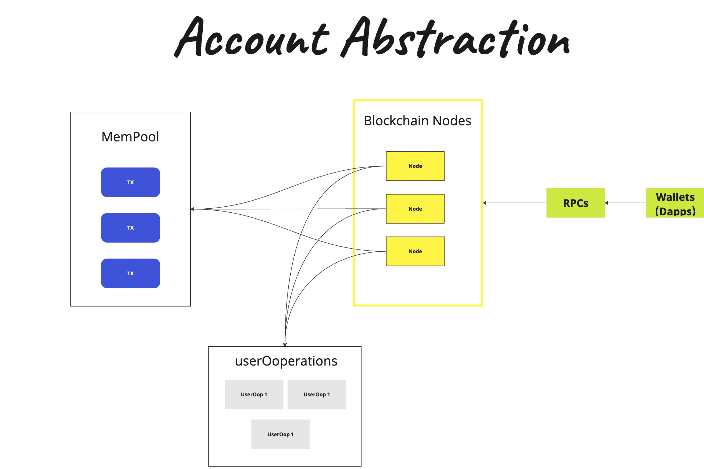
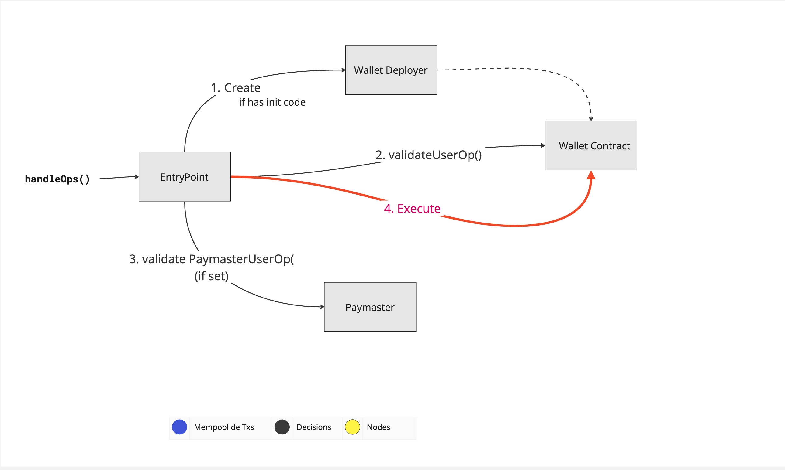

# Fluxo de Transação com Abstração de Conta

O fluxo de transação com Abstração de Conta envolve vários passos, desde a criação da transação até a sua inclusão em um bloco. Aqui está uma visão geral do processo:

## Aplicação Cria Transação (sem modificações)

1. A aplicação cria uma transação conforme necessário. Esta etapa não é afetada pela Abstração de Conta e permanece inalterada.

## Software da Wallet

2. O software da carteira entra em ação. Ele cria uma UserOperation (Operação do Usuário) com base na transação original. Em seguida, exibe a operação ao usuário e solicita que ele a assine.

## Envio para o Provedor de RPC (rpcProvider) (Bundler) - eth_sendUserOperation

3. Após a assinatura do usuário, a UserOperation é enviada para o provedor de RPC (Processamento em Carteira), também conhecido como "Bundler." Este provedor é responsável por processar e encaminhar a operação.

## Nó do Provedor de PC (Bundler)

4. O nó do provedor de PC verifica a validade da operação durante a fase de verificação. Ele faz isso usando uma chamada de visualização (view-call) ao EntryPoint (Ponto de Entrada).

5. Após a verificação bem-sucedida, a operação é adicionada à mempool de UserOperations (Mempool de Operações do Usuário).

## Construtor de Blocos (Antigamente Minerador): Adição a um Bloco

6. O construtor de blocos, anteriormente conhecido como minerador, coleta as UserOperations da mempool e as inclui em um bloco.

7. A operação é executada como uma transação "handleOps" dentro do bloco.

Este é um resumo do fluxo de transação com Abstração de Conta, que visa melhorar a experiência do usuário e a flexibilidade ao interagir com a rede Ethereum.

## Arquitetura offChain 

## Smart Wallet (Carteira Inteligente)

O usuário interage com sua carteira inteligente, que constrói uma "UserOperation". Esta "UserOperation" representa uma ação que o usuário deseja realizar na blockchain, como enviar uma transação ou interagir com um contrato inteligente. A "UserOperation" é assinada off-chain, usando a chave privada do usuário.

## Bundler (Agrupador)

A "UserOperation" assinada é enviada para um nó agrupador via Chamada de Procedimento Remoto (RPC). O nó agrupador é um software que coleta várias "UserOperations" e as agrupa em um pacote. O nó agrupador suporta uma mempool alternativa de "UserOps", que é um pool de "UserOperations" pendentes esperando para serem incluídas na blockchain.

## Contrato de Ponto de Entrada (EntryPoint)

O nó agrupador envia o pacote de "UserOperations" para o contrato de Ponto de Entrada na blockchain Ethereum, chamando EntryPoint.handleOps(). O contrato de Ponto de Entrada é um contrato singleton que lida com as "UserOperations" recebidas. Ele verifica as assinaturas e verifica se o Patrocinador (se houver) possui fundos suficientes para cobrir as taxas de transação.

## Execução na Cadeia (On-Chain Execution)

Uma vez que o contrato de Ponto de Entrada recebe as "UserOperations", o restante do tratamento da operação é realizado na cadeia. O contrato de Ponto de Entrada valida a transação agrupada e, se for válida, ela é adicionada a um bloco na blockchain Ethereum. Isso completa a "UserOperation", e a ação solicitada pelo usuário é executada.

Este é um resumo do processo de interação com a blockchain usando uma "Smart Wallet". Esse processo visa melhorar a experiência do usuário ao permitir que ações sejam realizadas de forma mais eficiente e flexível na blockchain Ethereum.

## Arquitetura OnChain

